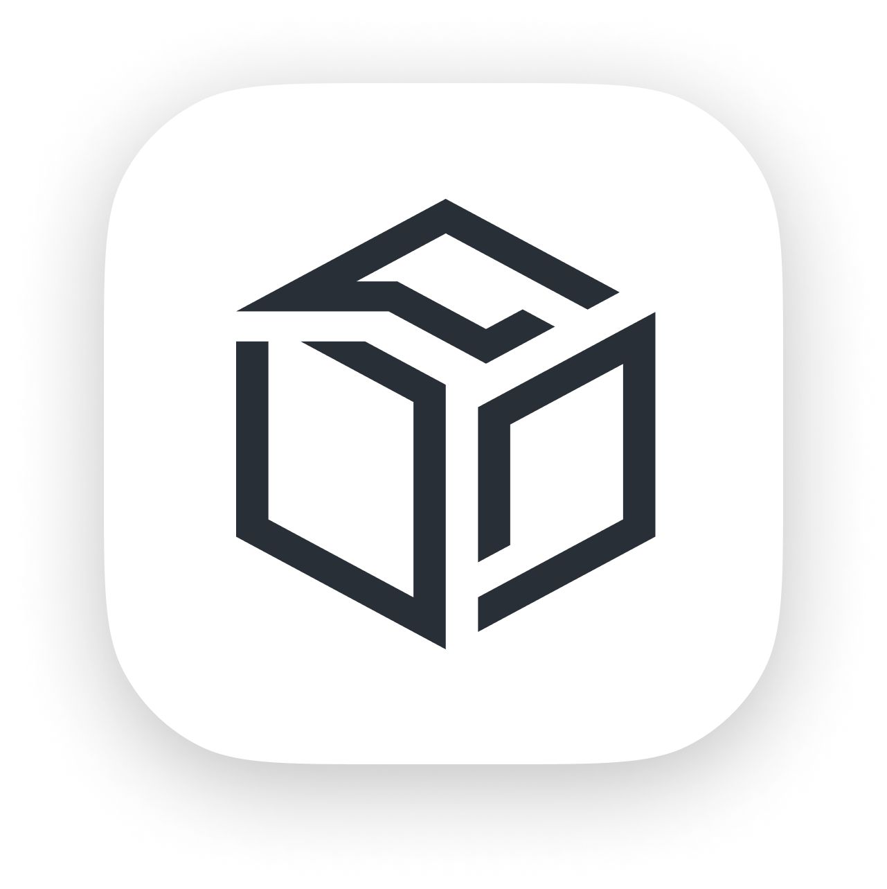

  

<h1 align="center">Yenno</h1>
Yenno helps ML related lab dynamically try different deployment options on their own kubernetes cluster.
[Work In Progress]
ex: Federated learning local Services

## TODO (Both frontend & backend)
- [ ] Github authentication
- [ ] Local k8s cluster environment checking
- [ ] Detection micro services deployment
- [ ] Federation learning AIoT micro services deployment
- [ ] Dynamic deployment options configuration (node specification)
- [ ] Log handling
- [ ] Apply configuration history
- [ ] CPU memory consumption graph
- [ ] Model performance graph
- [ ] Endpoint expose with generated url (subdomain)
- [ ] Still adding...
